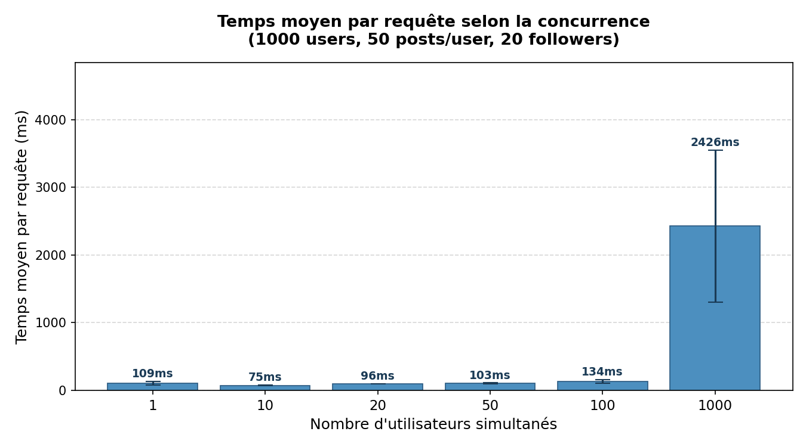
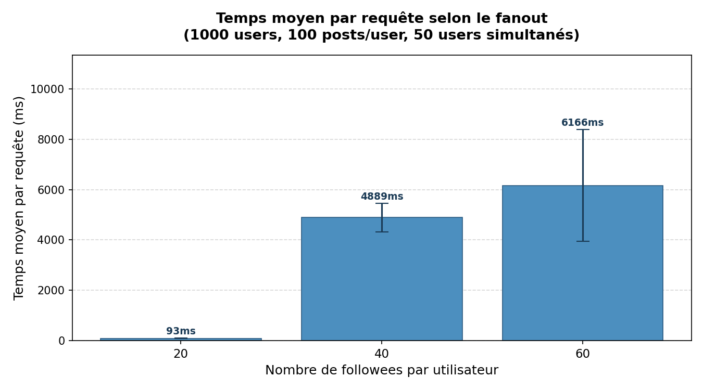

# Observations — Benchmark TinyInsta

---

## Expérience 1 — Concurrence

Les temps restent stables entre 75 et 134 ms de 1 à 100 users l'autoscaling fait son travail, je passe de 1 à 4 instances sans dégradation notable. À 1 000 users par contre ça explose : moyenne à 2 426 ms, soit ×20 par rapport à 100 users. La variance est énorme entre les runs parce que le nombre d'instances au démarrage du run varie beaucoup (4 à 19). J'ai aussi eu des erreurs HTTP 500 causées par le timeout de 60 s d'App Engine qui se déclenche quand les requêtes s'accumulent trop vite.

J'ai rencontré des contrainte, le premier problème c'est le démarage à froit toutes les instances sont supprimées avant chaque niveau, ce qui force App Engine à redémarrer depuis zéro.

Ensuite, l'autoscaling non-déterministe crée une variance énorme entre les runs. Le nombre d'instances au démarrage varie de 4 à 19, ce qui explique les écarts observés à 1 000 users.

Enfin, le timeout de 60s d'App Engine entre en jeu à 1 000 users simultanés certaines requêtes dépassent la limite de traitement et génèrent des HTTP 500.

**Est-ce que l'expérience 1 est scalable ?** Oui, mais seulement jusqu'à un certain point. De 1 à 100 users, App Engine scale et la latence reste correcte, c'est ce qui est attendu d'un PaaS. À partir de 1 000 users le système lâche, et ajouter des instances ne suffit plus parce que le goulot est côté Datastore. La scalabilité en concurrence est donc limitée par le nombre de lectures Datastore par requête, pas par la capacité de calcul des instances.

---

## Expérience 2 — Fanout

| Fanout | Moyenne (ms) | Ratio réel | Ratio théorique |
|--------|-------------|------------|-----------------|
| 20     | 93          | ×1         | ×1              |
| 40     | 4 889       | ×50        | ×2              |
| 60     | 6 166       | ×60        | ×3              |

Le ratio est bien plus grand que prévu parce qu'à 50 users simultanés, je génère jusqu'à `50 × 41 = 2 050` requêtes Datastore en parallèle elles se marchent dessus et chacune devient lente. Plusieurs runs ont aussi planté et ont été exclus des moyennes.

J'ai rencontré d'autre contrainte. Le problème de N+1 Doubler le fanout ne double pas juste le nombre de requêtes, ça provoque une compétition sur Datastore qui démultiplie la latence bien au-delà du ratio théorique.

Cette compétition sur Datastore est directement mesurable, 2 050 lectures simultanées avec 40 followees. Chaque requête individuelle ralentit à cause de la contention, ce qui explique le ratio ×50 au lieu du ×2 attendu.

Le timeout de 60 s d'App Engine a aussi causé des échecs directs avec 40 et 60 followees, où plusieurs runs ont planté. Ces runs ont été exclus des moyennes pour ne pas déformer les résultats.

Enfin, l'autoscaling non-déterministe reste une variable parasite : avec 60 followees, les temps varient de 3 391 ms (15 instances) à 8 114 ms (6 instances). Le nombre d'instances actives est la variable dominante, plus que les foolowees. D'où le kill + warmup avant chaque run individuel.

**Est-ce que l'expérience 2 est scalable ?** Non, pas avec cette architecture. La latence évolue en O(Followees) et dépasse déjà les 5 secondes à seulement 40 followees avec 50 users simultanés c'est inutilisable en prod. Le problème vient du modèle Fan-out on Read : peu importe combien d'instances App Engine sont lancées, chaque requête timeline continuera de faire N aller-retours vers Datastore.

---

## Conclusion

L'app scale correctement jusqu'à ~100 users à faible followees grâce à l'autoscaling. Au-delà, le modèle Fan-out on Read est le vrai goulot : chaque timeline coûte N lectures Datastore, et ça devient vite ingérable. La solution serait un Fan-out on Write, pré-calculer la timeline à l'écriture de chaque post pour n'avoir qu'un seul accès en lecture.
